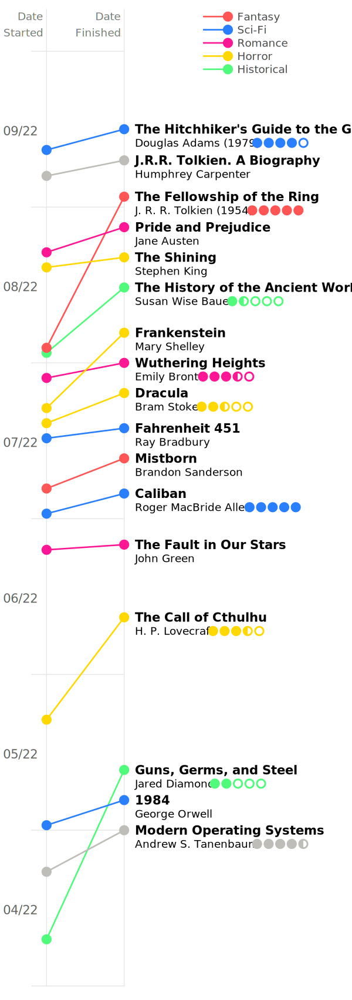

# Reading Timeline

Visualise your readings with an automatically generated timeline.

<p align="center">
	
</p>

## Getting Started

Reading Timeline is intended to work without the need to access or modify the source code. To generate the timeline, there are some parameters that are described in the following files:

- `data.yml`. Contains the actual book data. Categories, books, and all of their properties.
- `params.yml`. Contains the parameters used to generate the drawing. For example: the color of the timeline, the width of its line, the font of the labels, etc.

These files should be self-explanatory, so feel free to play around to fully  customise your timeline.

Further explanation on how the program works will soon be available on [my website](https://www.albertcanales.com)

## Prerequisites

The program can be run on all operating systems. The prerequisites are:

- [Git](https://git-scm.com/book/en/v2/Getting-Started-Installing-Git). Used in recommended installation but not required
- [Python](https://wiki.python.org/moin/BeginnersGuide/Download)
- [Pip](https://pip.pypa.io/en/stable/installation/)
- [VirtualEnv](https://packaging.python.org/en/latest/guides/installing-using-pip-and-virtual-environments/#installing-virtualenv)

For now, the tool is installed and used as a CLI application, so some basic terminal usage will be needed.

## Installation

0. Install the prerequisites above
1. Open a terminal and move to the directory in which you what to install the program. Skip this step (and ignore `<DIRECTORY>/` from now on) if the home folder is adequate for you.
``` sh
cd <DIRECTORY>
```
2. Clone the repository and move inside of it
``` sh
git clone https://github.com/albertcanales/reading-timeline.git && cd reading-timeline
```
3. Install required Python packages on a virtual environment
``` sh
make install
```

## Usage

To use the program, first move into the installation directory:

	cd <DIRECTORY>/reading-timeline


And run the program:

	make run

Additionally, you may use `make run-v` or `make run-vv` to get more information on the output.

## Updating

To update to the latest features, first move into the installation directory:

	cd <DIRECTORY>/reading-timeline

And then pull the changes from master:

	git pull


## Contributing

Giving bug reports and feature requests is greatly appreciated. The easiest ways to do so are to [contact me directly](mailto:contact@albertcanales.com) or to open an issue. You can also make a pull request, but I would recommend first getting in touch to ease the task of merging.

## Help

The following command shows the program's help and options:

	make help

## License

This project is licensed under the MIT License - see the LICENSE.md file for details

## Acknowledgments

This project has been completely based on the great design from [
Jeff Allen](https://jamaps.github.io/words/words.html).

Thanks also to [Abel Doñate](https://abeldonate.com) for the ideas, testing and feedback.
